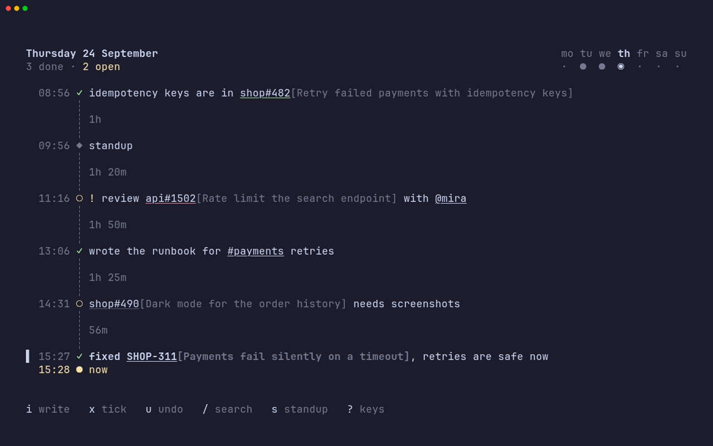

<h1 align="center">codicitas</h1>

<p align="center">
  
</p>

<p align="center">
  Write down what you did, what's next and what's in your way, as it happens.<br>
  Your standup, a backlog and a searchable history come for free.
</p>

<p align="center">
  <a href="#install">Install</a> ·
  <a href="#see-it-in-use">Demo</a> ·
  <a href="#write">Write</a> ·
  <a href="#keys">Keys</a> ·
  <a href="#modules">Jira and GitHub</a> ·
  <a href="#from-the-shell">Shell</a> ·
  <a href="#your-data">Your data</a>
</p>

The day runs down a single line. Breaks show how long they were, and on today the line ends at **now**, with the time since your last entry just above it, so a quiet stretch is hard to miss.

## Install

codicitas needs Node.js 23 or newer.

```bash
git clone https://github.com/sovrin/codicitas.git
cd codicitas
npm install
npm link
```

`npm install` builds it, and `npm link` puts it on your PATH as `codi`.

## See it in use

<p align="center">
  
</p>

## Write

Press <kbd>i</kbd> and write where the day has got to. <kbd>enter</kbd> saves.

```
/todo !h @10:30 review api#1502 with @mira
```

| Part       | What it does                                                                                                           |
| ---------- | ---------------------------------------------------------------------------------------------------------------------- |
| `/todo`    | the tag: `/todo` `/done` `/blocked` `/til` `/meet` `/note`, or any start of one that is unambiguous, like `/d` or `/b` |
| `!h`       | a todo's priority: `!c` `!h` `!m` `!l`, for critical, high, mid and low. A todo without one is mid                     |
| `@10:30`   | when it happened, for writing it down after the fact: `@22:30`, `@10:30pm` and `@9am` work too                         |
| `api#1502` | a reference. `#topics`, `#412`, `PROJ-123`, pull requests like `legacy#12` and `@colleagues` are underlined            |

The parts combine in any order. Entries are sorted by time, so one written down late still lands where it happened. Colour only appears where something needs you: yellow for open todos and now, red for what's blocking you, green for what's done. Critical todos show `!!`, high ones `!`, and low ones a grey circle.

<details>
<summary>Editing an entry</summary>

| Keys                                                                                   | Do                                                                                                                    |
| -------------------------------------------------------------------------------------- | --------------------------------------------------------------------------------------------------------------------- |
| <kbd>shift</kbd>+<kbd>enter</kbd>                                                      | a new line; <kbd>alt</kbd>+<kbd>enter</kbd> or <kbd>ctrl</kbd>+<kbd>j</kbd> where a terminal can't tell it from enter |
| <kbd>tab</kbd> <kbd>shift</kbd>+<kbd>tab</kbd>                                         | indent and outdent, for nested lists                                                                                  |
| <kbd>@</kbd> <kbd>#</kbd>                                                              | offer the colleagues and topics you've used, most used first                                                          |
| <kbd>tab</kbd> <kbd>→</kbd>                                                            | take the suggestion                                                                                                   |
| <kbd>ctrl</kbd>+<kbd>n</kbd> <kbd>ctrl</kbd>+<kbd>p</kbd>                              | choose another suggestion                                                                                             |
| <kbd>ctrl</kbd>+<kbd>t</kbd>                                                           | the next tag                                                                                                          |
| <kbd>ctrl</kbd>+<kbd>w</kbd> <kbd>ctrl</kbd>+<kbd>u</kbd> <kbd>ctrl</kbd>+<kbd>k</kbd> | delete a word, to the line's start, to its end                                                                        |
| <kbd>esc</kbd>                                                                         | cancel                                                                                                                |

A name starts with a letter, so `@10:30` at the start is still a time.

</details>

## Keys

Press <kbd>?</kbd> in codicitas for all of them.

| Key                       | In the journal                                                 |
| ------------------------- | -------------------------------------------------------------- |
| <kbd>i</kbd>              | write a new entry                                              |
| <kbd>e</kbd>              | edit the selected entry                                        |
| <kbd>x</kbd>              | tick a todo off, or back on                                    |
| <kbd>+</kbd> <kbd>-</kbd> | raise or lower a todo's priority                               |
| <kbd>m</kbd>              | move the selected entry to another day                         |
| <kbd>d</kbd>              | delete the selected entry                                      |
| <kbd>u</kbd>              | undo the last change                                           |
| <kbd>j</kbd> <kbd>k</kbd> | move through the day                                           |
| <kbd>←</kbd> <kbd>→</kbd> | the previous and next day with entries                         |
| <kbd>t</kbd>              | back to today                                                  |
| <kbd>#</kbd> <kbd>@</kbd> | search for the entry's first topic or colleague                |
| <kbd>r</kbd>              | refresh the titles of the tickets and pull requests on the day |
| <kbd>q</kbd>              | quit                                                           |

| Key          | Opens                                                                                                                                                |
| ------------ | ---------------------------------------------------------------------------------------------------------------------------------------------------- |
| <kbd>s</kbd> | **Standup**: what got done since the last day you journaled, every open todo, and what's blocked. <kbd>y</kbd> copies it for your team chat          |
| <kbd>o</kbd> | **Open todos** from every day, from critical to low and oldest first. <kbd>x</kbd> ticks one off where it was written                                |
| <kbd>/</kbd> | **Search** every day as you type. Every word has to match; `/todo` narrows by tag, `!c` by priority, and <kbd>enter</kbd> opens the entry on its day |
| <kbd>,</kbd> | **Settings**, saved as you change them. <kbd>tab</kbd> goes to **Modules**                                                                           |

<details>
<summary>Settings</summary>

| Setting              | Choices                                                                                 |
| -------------------- | --------------------------------------------------------------------------------------- |
| Show breaks from     | 15, 30 or 45 minutes, 1 hour, or never                                                  |
| Count quiet time     | the time since your last entry above now, on or off                                     |
| Week starts on       | Monday or Sunday                                                                        |
| Clock                | 24-hour or 12-hour; both can be typed either way                                        |
| New entries start as | the tag an entry gets without a `/tag`, also for `codi add`                             |
| Tab width            | 2 or 4 spaces                                                                           |
| Key hints            | shown or hidden, once you know them                                                     |
| Colour-blind mode    | says with marks what is otherwise only a colour, like how a pull request's checks stand |

</details>

## Modules

Modules know more about what you write about: a ticket's title from Jira, a pull request's checks from GitHub. Open **Settings** with <kbd>,</kbd> and press <kbd>tab</kbd>. A module is off until you turn it on with <kbd>←</kbd> <kbd>→</kbd>, and <kbd>enter</kbd> opens its settings. What it can't work without is listed first, under **required**, and says `not set` in yellow until it's given; a token from your environment counts.

What a module finds is shown after what it belongs to, and a reference it knows becomes a link: <kbd>cmd</kbd>- or <kbd>ctrl</kbd>-click it in iTerm2, Ghostty, kitty, WezTerm, Windows Terminal or the VS Code and JetBrains terminals. macOS Terminal shows it as text.

A module only asks about what's on screen, as you get to it, and about what your open todos mention, since those carry over from day to day. Answers are kept in the journal, so they show at once the next time and offline. <kbd>r</kbd> asks again about the day you're looking at.

### Jira

Tickets like `ACME-4217` show their title after them, faded: `ACME-4217[Download times out]`. Once a ticket is done it steps back, faded as a whole, and once it's resolved as not to be done, like won't do or duplicate, it's struck through as well.

| Setting |          | What goes there                                                                                                                             |
| ------- | -------- | ------------------------------------------------------------------------------------------------------------------------------------------- |
| Site    | required | your Jira, like `acme.atlassian.net`                                                                                                        |
| Token   | required | a Jira Cloud [API token](https://id.atlassian.com/manage-profile/security/api-tokens), or a personal access token on Server and Data Center |
| Email   |          | on Jira Cloud, the account the token belongs to; empty on Jira Server or Data Center                                                        |

A ticket gets its title after its first mention in an entry, unless you already wrote something in brackets after it, and the standup you copy takes the titles along. An open ticket is asked about again after a day, one that is done after a week. A journal that had Jira set up before it became a module keeps it on.

### GitHub

Give your repositories short names, and a pull request like `legacy#12` shows its title after it, faded like Jira's, and how its checks stand in the colour of its underline: green while they pass, red while they fail, yellow while they run. Once a pull request is merged it steps back, faded, and once it's closed without merging it's struck through as well, its title with it. An issue with that number works the same way, faded once closed.

> [!NOTE]
> The underline's colour is the only thing that says how the checks stand. Turn on **Colour-blind mode** in the settings to see them as a mark after the pull request instead: `legacy#12 ✗[Fix login]`. It also helps in a terminal that draws every underline in the colour of its text; kitty, WezTerm, Ghostty, iTerm2 and the one in VS Code draw them in any colour. In tmux, let the colours through with `set -as terminal-features ',*:usstyle'`.

| Setting      |          | What goes there                                                  |
| ------------ | -------- | ---------------------------------------------------------------- |
| Repositories | required | short names for repositories, like `legacy` for `sovrin/sonotas` |
| Token        | required | a GitHub token; see [which one](#which-token)                    |
| Titles       |          | shown or hidden                                                  |
| Checks       |          | shown or hidden                                                  |
| Look again   |          | every minute, every 5 or 15 minutes, or only when codi opens     |

**Repositories** opens a list of its own. <kbd>a</kbd> adds one: type `sovrin/sonotas` or paste its address from GitHub, then take the short name it offers or type another. <kbd>enter</kbd> changes one and <kbd>d</kbd> deletes it. Short names already in your journal without a repository, like `legacy` from `legacy#12`, are waiting in the list.

<details>
<summary>Checks</summary>

| Checks               | Underline | In colour-blind mode |
| -------------------- | --------- | -------------------- |
| pass                 | green     | `✓`                  |
| fail                 | red       | `✗`                  |
| are running          | yellow    | `●`                  |
| there are none       | grey      | `○`                  |
| the token can't read | grey      | `?`                  |

Running checks are asked about again after a minute, other open pull requests after three, and merged or closed ones once a day. Titles, checks and how often to look again change what you see at once, without asking GitHub again, and so do the templates.

</details>

#### Which token

| Token                                                                               | Needs                                                               | Shows                                |
| ----------------------------------------------------------------------------------- | ------------------------------------------------------------------- | ------------------------------------ |
| [classic](https://github.com/settings/tokens/new?scopes=repo&description=codicitas) | the `repo` scope; no scope at all for public repositories only      | titles, state and checks             |
| `gh auth token`, if you use the GitHub CLI                                          | nothing more, it has `repo` already                                 | titles, state and checks             |
| [fine-grained](https://github.com/settings/personal-access-tokens/new)              | read access to **Pull requests** and **Issues** on the repositories | titles and state; `?` for the checks |

> [!TIP]
> Use a classic token, or leave the setting empty and `export GH_TOKEN=$(gh auth token)`. GitHub has no permission for checks on fine-grained tokens, so with one codicitas shows `?` rather than guess.

A pull request that stays without a title is one GitHub didn't find, which is also how it answers for a repository the token can't see. A fine-grained token needs the organization as its **resource owner**, the repository under **Repository access**, and the organization's approval where it asks for it; with single sign-on, authorize the token under **Configure SSO**. **Modules** lists what GitHub didn't find, and asks again every quarter of an hour, or right away with <kbd>r</kbd>.

### Templates

Each module writes its references with templates of its own, listed under **templates** on its page. Type one to change it, with a preview of what it looks like as you type; empty it to go back to the module's default.

| Template | Writes                                  | Default          | Placeholders                        |
| -------- | --------------------------------------- | ---------------- | ----------------------------------- |
| Title    | a title at its first mention, on screen | `{ref}[{title}]` | `{ref}` `{title}`                   |
| Mark     | how checks stand, in colour-blind mode  | `{ref} {mark}`   | `{ref}` `{mark}`                    |
| Copied   | a reference in the standup you copy     | `{ref}[{title}]` | `{ref}` `{title}` `{link}` `{mark}` |

`[{ref}]({link}) {title}` as **Copied** pastes Markdown links, and `<{link}|{ref}> {title}` Slack's. A reference you follow with your own brackets, `(…)` or `[…]`, keeps what you wrote. `{{` and `}}` are braces.

## From the shell

```bash
codi add "/done shipped the importer"
codi add "/todo !h @9:30 follow up with @anna on #auth"
git log -1 --format=%s | codi add /done -
```

`-` reads the text from stdin, so `codi` fits into git hooks and shell aliases. Commands start in a fraction of the time the journal takes, because they never load it.

## Your data

Everything lives in one SQLite file, `~/.local/share/codicitas/journal.db`: your entries, an index of who and what they mention, what the modules found, and your settings. Back it up by copying it; it upgrades itself when a new version of codicitas needs more from it.

| Variable                   | Does                                             |
| -------------------------- | ------------------------------------------------ |
| `CODICITAS_DIR`            | keep the journal in this directory instead       |
| `XDG_DATA_HOME`            | respected when `CODICITAS_DIR` isn't set         |
| `JIRA_API_TOKEN`           | the Jira token, when the setting is left empty   |
| `GITHUB_TOKEN`, `GH_TOKEN` | the GitHub token, when the setting is left empty |

Tokens typed into the settings are kept in the journal as they are; the variables keep them out of it.

> [!WARNING]
> Don't keep the journal in a folder synced by Dropbox or iCloud while codicitas is open. SQLite writes a log next to the database, and a sync that copies one without the other can corrupt it.

## Development

```bash
npm start           # run from source
npm test            # tests
npm run typecheck
npm run lint
npm run build       # bundle to dist/
```

The code is split into `src/services` (journal logic, storage, text editing, parsing; plain functions with their own tests), `src/modules` (integrations like Jira and GitHub, each with its settings and a way to look things up), `src/views` (one component per screen) and `src/components` (the pieces they share). CI runs typecheck, lint, tests and the build on Node 24 and 26.

<details>
<summary>Recording the demo</summary>

The demo and the screenshot at the top are recorded with [VHS](https://github.com/charmbracelet/vhs) in Docker, against a journal filled by `demo/seed.ts` and stand-ins for Jira and GitHub in `demo/mock.mjs`, so it needs no accounts. codi runs in tmux, whose status bar carries the captions.

```bash
npm run record   # writes demo/demo.gif and demo/screenshot.png
```

It needs Docker running, and rebuilds the image when codicitas changed. The script is `demo/demo.tape`; the tape, seed and mocks are mounted into the container, so `docker compose run --rm demo` records again without a rebuild when only they changed.

</details>

## License

MIT
