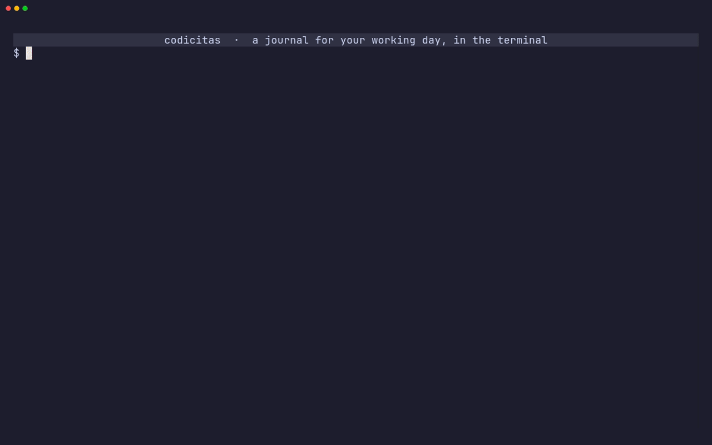

# codicitas

A journal for your working day, in the terminal. Write down what you did, what's next and what's in your way as it happens, and get your standup, a prioritised backlog and a searchable history for free.



The day runs down a single line. Breaks of half an hour or more show how long they were, and on today the line ends at **now**, with the time since your last entry just above it, so a quiet stretch is hard to miss.

## Install

codicitas needs Node.js 23 or newer.

```bash
git clone https://github.com/sovrin/codicitas.git
cd codicitas
npm install
npm link
```

`npm install` builds codicitas, and `npm link` puts it on your PATH as `codi`.

## Writing

Press `i` and write where the day has got to. Enter saves.

| Start an entry with                               | To                                                                                    |
| ------------------------------------------------- | ------------------------------------------------------------------------------------- |
| `/todo` `/done` `/blocked` `/til` `/meet` `/note` | tag it; any unambiguous start works, like `/d` or `/b`                                |
| `!critical` `!high` `!mid` `!low`                 | give a todo a priority; `!c` `!h` `!m` `!l` are enough, and a todo without one is mid |
| `@10:30` `@22:30` `@10:30pm` `@9am`               | say when it happened, for writing things down after the fact                          |

They combine in any order: `/todo !h @10:30 review the retry logic`. Entries are sorted by time, so one written down late still lands where it happened.

- **Shift+enter** starts a new line. In terminals that can't tell it apart from enter, use **alt+enter** or **ctrl+j**.
- **Tab** and **shift+tab** indent and outdent, so nested lists are easy.
- **`#topics`**, issue numbers like `#412`, pull requests like `legacy#12` and tickets like `PROJ-123` are underlined, and so are **`@colleagues`**. Names start with a letter, so `@10:30` at the start is still a time.
- Typing `@` or `#` offers the colleagues and topics you've used before, most used first. **Tab** or **→** takes the suggestion, **ctrl+n** and **ctrl+p** choose another.

Critical todos show `!!` and high ones `!` in front of their text, low ones a grey circle. Colour only appears where something needs you: yellow for open todos and now, red for what's blocking you, green for what's done.

## Keys

Press `?` in codicitas for the full list.

| Key     | Does                                                     |
| ------- | -------------------------------------------------------- |
| `i`     | write a new entry                                        |
| `e`     | edit the selected entry                                  |
| `x`     | tick a todo off, or back on                              |
| `+` `-` | raise or lower a todo's priority                         |
| `m`     | move the selected entry to another day                   |
| `d`     | delete the selected entry                                |
| `u`     | undo the last change                                     |
| `j` `k` | move through the day                                     |
| `←` `→` | previous and next day with entries, `t` back to today    |
| `#` `@` | search for the selected entry's first topic or colleague |
| `r`     | refresh the titles of the tickets on the day             |
| `q`     | quit                                                     |

## Views

| Key | View                                                                                                                                           |
| --- | ---------------------------------------------------------------------------------------------------------------------------------------------- |
| `s` | **Standup**: what got done since the last day you journaled, every open todo, and what's blocked. `y` copies it as text for your team chat.    |
| `o` | **Open todos** from every day as a backlog, grouped from critical to low and oldest first within each. `x` ticks one off where it was written. |
| `/` | **Search** every day as you type. All words have to match; `/todo` narrows by tag, `!c` by priority, and enter opens the entry on its day.     |
| `,` | **Settings**, saved as you change them. `tab` switches to **Modules**.                                                                         |

The settings:

| Setting              | Choices                                                     |
| -------------------- | ----------------------------------------------------------- |
| Show breaks from     | 15, 30 or 45 minutes, 1 hour, or never                      |
| Count quiet time     | the time since your last entry above now, on or off         |
| Week starts on       | Monday or Sunday                                            |
| Clock                | 24-hour or 12-hour; both can be typed either way            |
| New entries start as | the tag an entry gets without a `/tag`, also for `codi add` |
| Tab width            | 2 or 4 spaces                                               |
| Key hints            | shown or hidden, once you know them                         |

## Modules

Modules know more about some of what you write, like the titles of your tickets. They have a page of their own: open **Settings** (`,`) and press `tab`. Each module is off until you turn it on there with `←` `→`, and `enter` opens its own settings. What a module can't work without is listed first, under **required**, and shows `not set` in yellow until it's given; a token taken from your environment counts, and says where it comes from. Titles a module finds are shown faded after what they belong to, and a reference it knows becomes a link. A module is only asked about what is on screen, in the journal, a search, the standup or the open todos, as you get to it, and about what your open todos mention, wherever they are, since those carry over from day to day. What it answered before shows everywhere at once. `r` refreshes the titles on the day you're looking at.

### Jira

Turn Jira on under **Modules** and give codicitas your Jira in its settings, and every ticket like `ACME-4217` shows its title after it, faded: `ACME-4217 (Download times out)`. The ticket becomes a link to it too: cmd- or ctrl-click it in iTerm2, Ghostty, kitty, WezTerm, Windows Terminal or the VS Code and JetBrains terminals. macOS Terminal doesn't support terminal links and shows it as text. Select a Jira setting and press enter to type it.

| Setting | What goes there                                                                                                                             |
| ------- | ------------------------------------------------------------------------------------------------------------------------------------------- |
| Site    | your Jira, like `acme.atlassian.net`                                                                                                        |
| Email   | on Jira Cloud, the account the token belongs to. On Jira Server or Data Center leave it empty                                               |
| Token   | a Jira Cloud [API token](https://id.atlassian.com/manage-profile/security/api-tokens), or a personal access token on Server and Data Center |

Titles are asked for in the background and kept in the journal, so they show at once the next time and work offline; each is asked for again after a week. Press `r` to refresh the tickets on the day you're looking at right away. A ticket gets its title after its first mention in an entry, unless you already wrote something in brackets after it. The standup you copy with `y` takes the titles along.

A journal that had Jira set up before it became a module keeps it on.

The token is stored in the journal database as it is. To keep it out, leave the setting empty and set `JIRA_API_TOKEN` in your environment instead.

## From the shell

```bash
codi add "/done shipped the importer"
codi add "/todo !h @9:30 follow up with @anna on #auth"
git log -1 --format=%s | codi add /done -
```

`-` reads the text from stdin, so `codi` fits into git hooks and shell aliases. Commands start in a fraction of the time the full journal takes, because they never load it.

### GitHub

Turn GitHub on under **Modules**, give your repositories short names, and a pull request like `legacy#12` shows how its checks stand in front of it and its title after it: `✗legacy#12 (Fix login)`. It links to the pull request too, and an issue with that number works the same way.

| Setting      | What goes there                                                                  |
| ------------ | -------------------------------------------------------------------------------- |
| Repositories | short names for your repositories, like `legacy` for `sovrin/sonotas`; see below |
| Token        | a GitHub token; see below for which                                              |
| Titles       | shown or hidden                                                                  |
| Colours      | by state, or off                                                                 |
| Badges       | checks and state, checks only, or hidden                                         |
| Look again   | every minute, every 5 or 15 minutes, or only when codi opens                     |

With colours by state, a pull request and its title are drawn in the colour of how it stands: `legacy#12` is green while it is open, purple once it is merged and red once it is closed; an issue is green while open and purple once closed. With colours off, titles are faded. Titles, colours, badges and how often to look again change what you see at once, without asking GitHub again.

**Repositories** opens a list of its own. `a` adds one: type `sovrin/sonotas` or paste its address from GitHub, then take the short name it offers, the repository's own name, or type another. `enter` changes one and `d` deletes it. Short names you already wrote in the journal without a repository, like `legacy` from `legacy#12`, are listed too, so giving them one is a matter of `enter` and the repository.

| Badge | Means                                          |
| ----- | ---------------------------------------------- |
| `✓`   | checks pass (green)                            |
| `✗`   | checks fail (red)                              |
| `●`   | checks are running (yellow), or a closed issue |
| `○`   | no checks (grey), or an open issue (green)     |
| `◆`   | merged                                         |
| `⊘`   | closed without merging                         |
| `?`   | the token can't read the checks                |

While codicitas is open it looks again every minute: running checks are asked about again after a minute, other open pull requests after three, and merged or closed ones once a day. `r` asks right away.

#### Which token

| Token                                                                               | Needs                                                               | Shows                                |
| ----------------------------------------------------------------------------------- | ------------------------------------------------------------------- | ------------------------------------ |
| [classic](https://github.com/settings/tokens/new?scopes=repo&description=codicitas) | the `repo` scope; no scope at all for public repositories only      | titles, state and checks             |
| `gh auth token`, if you use the GitHub CLI                                          | nothing more, it has `repo` already                                 | titles, state and checks             |
| [fine-grained](https://github.com/settings/personal-access-tokens/new)              | read access to **Pull requests** and **Issues** on the repositories | titles and state; `?` for the checks |

A classic token is the one to use. GitHub has no permission for checks on fine-grained tokens, so with one codicitas can't tell whether checks pass; it shows `?` instead of guessing. An organization that uses single sign-on also needs the token authorized for it, under **Configure SSO** next to the token.

A pull request that stays without a title is one GitHub didn't find. GitHub answers that way for a repository the token can't see, too, so it usually means the token: a fine-grained one needs the organization as its **resource owner**, the repository under **Repository access**, and, where the organization asks for it, its approval. **Modules** lists what GitHub didn't find, and codicitas asks about it again every quarter of an hour, or right away with `r`.

The token is stored in the journal as it is. To keep it out, leave the setting empty and set `GITHUB_TOKEN` or `GH_TOKEN` in your environment, for example `export GH_TOKEN=$(gh auth token)`.

## Your data

Everything lives in one SQLite file, `~/.local/share/codicitas/journal.db`: your entries, an index of the colleagues and topics they mention, the titles modules found, and your settings. Back it up by copying it; it upgrades itself when a new version of codicitas needs more from it.

| Variable                   | Does                                             |
| -------------------------- | ------------------------------------------------ |
| `CODICITAS_DIR`            | keep the journal in this directory instead       |
| `XDG_DATA_HOME`            | respected when `CODICITAS_DIR` isn't set         |
| `JIRA_API_TOKEN`           | the Jira token, when the setting is left empty   |
| `GITHUB_TOKEN`, `GH_TOKEN` | the GitHub token, when the setting is left empty |

Don't keep the journal in a folder synced by Dropbox or iCloud while codicitas is open. SQLite writes a log next to the database, and a sync that copies one without the other can corrupt it.

## Development

```bash
npm start           # run from source
npm test            # tests
npm run typecheck
npm run lint
npm run build       # bundle to dist/
```

The demo above is recorded with [VHS](https://github.com/charmbracelet/vhs) in Docker, against a journal filled by `demo/seed.ts` and stand-ins for Jira and GitHub in `demo/mock.mjs`, so it needs no accounts:

```bash
docker compose run --rm demo           # writes demo/demo.gif
docker compose run --build --rm demo   # after changing codicitas itself
```

The script is `demo/demo.tape`; the tape, seed and mocks are mounted, so changing them needs no rebuild.

The code is split into `src/services` (journal logic, storage, text editing, parsing; plain functions with their own tests), `src/modules` (integrations like Jira, each with its settings and a way to look up titles), `src/views` (one component per screen) and `src/components` (the pieces they share). CI runs typecheck, lint, tests and the build on Node 24 and 26.

## License

MIT
